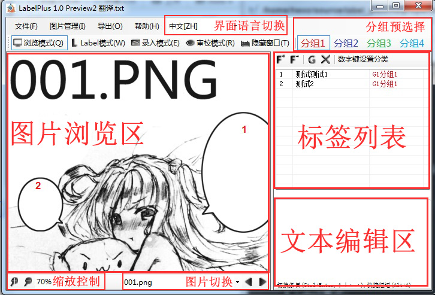

# 基本操作

在**图片浏览区**中的操作:

| 功能                   | 操作                                      |
| ---------------------- | ----------------------------------------- |
| 插入标签               | Ctrl+鼠标左键                             |
| 删除标签               | Ctrl+鼠标右键                             |
| 移动标签               | 点击标签，再点击要移动到的位置            |
| 撤销标签               | Ctrl+Z                                    |
| 重做标签               | Ctrl+Y                                    |
|                        |                                           |
| 快速插入预设标签       | A键                                       |
| 更改添加标签的默认分组 | 数字键1-9                                 |
| 临时隐藏标签           | 按住V键                                   |
| 临时显示标签分组       | 按住C键                                   |
| 切换编辑模式           | Q/W/E/R                                   |
|                        |                                           |
| 向后翻页               | Tab，鼠标中键                             |
| 图片向前/后翻页        | ←/→键                                     |
| 图片滚动               | 鼠标滚轮=纵向滚动；Ctrl+鼠标滚轮=横向滚轮 |
| 图片缩放               | Alt+鼠标滚轮                              |

在**文本编辑区**中的操作:

| 功能                     | 操作      |
| ------------------------ | --------- |
| 切换到下一条标签         | Ctrl+回车 |
| 切换到上一条、下一条标签 | Ctrl+↑/↓  |
| 图片向前、向后翻页       | Ctrl+←/→  |
| 快速输入短语菜单         | Alt+A     |

在**标签列表**中的操作：

| 功能     | 操作      |
| -------- | --------- |
| 更改分组 | 数字键1-9 |
| 删除标签 | Del键     |

全局操作：

| 功能                       | 操作        |
| -------------------------- | ----------- |
| 保存                       | Ctrl+S      |
| 切换编辑模式               | Alt+Q/W/E/R |
| 老板键，隐藏到任务栏小图标 | Alt+T       |

