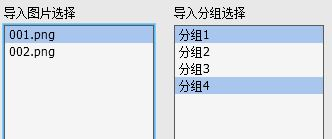
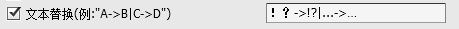
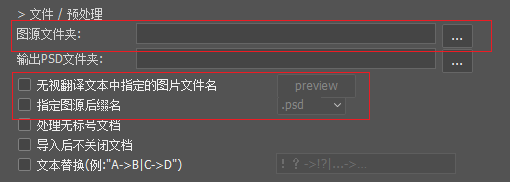
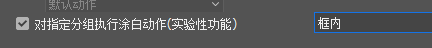
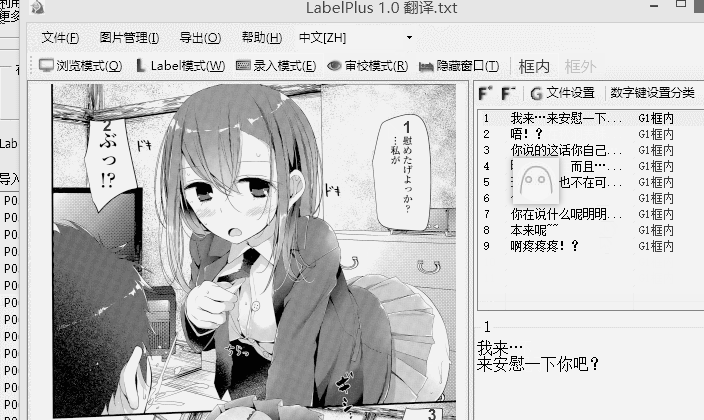
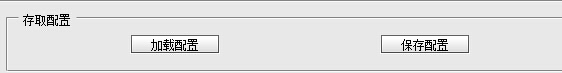
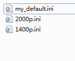
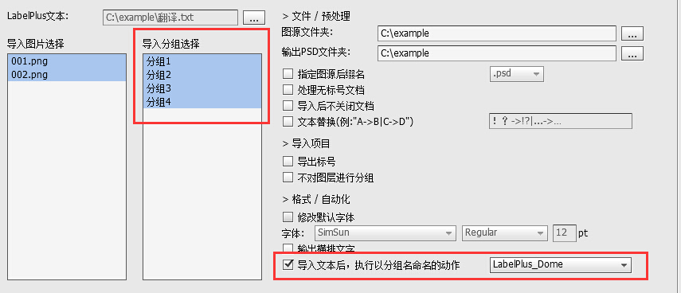
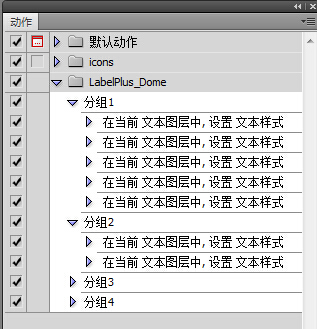
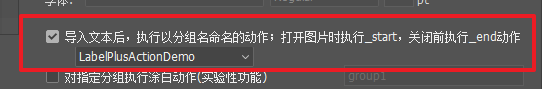

# PS文本导入脚本说明

作为嵌字人员, 了解LabelPlus的文本导入脚本的功能, 能避免一些重复劳动.

## ps脚本基本使用方法

请参考"快速上手"以及"基本操作"中的嵌字部分.

## 导入图片、分组选择说明

加载LabelPlus文本后，列表框中将出现项目  
:

脚本可以有选择性的导入**某图片的文本**和**某组文本,** 使用**Shift键**连续选择, 使用**Ctrl键**单项选择.

## 文本替换

导入文字之前将文本做**替换预处理,** 替换文本串需要根据需要自行编写  
:

想要将"A"替换为"B", 应书写规则为"A-&gt;B"，多项时以"\|"隔开.

**例1.全角逗号\(句号\)替换成半角逗号\(句号\)**

> ，-&gt;,\|。-&gt;.

**例2. 删除所有"！？"和"。"**

> ！？-&gt;\|。-&gt;

## 图源替换

Label的坐标均为以百分比表示, 图片的大小并不会影响导入效果.

同时, 脚本提供多种功能方便嵌字更换图源:

* 更改图源文件夹: 默认图源位于目录下, 也可以手动指定图源位置
* 无视文件名: 更换后的图源可能和翻译文本中的文件名完全不一样, 但是如果顺序相同, 脚本就可能自动处理, "preview"可以预览文件对应关系
* 指定图源后缀名: 如果图源仅改变了后缀名, 则可以使用该功能

## 自动涂白功能\(实验性功能\)

该功能在导入过程中, 对指定分组中的Label所在位置的封闭对话框进行涂白, 目前为实验性功能:

## 存取配置文件

利用存取配置文件，可以保存多组设置参数  
.

例如对不同分辨率的图源，配置不同默认字体大小参数等:

## 文档模板

v1.5.0之前，PS导入脚本中，用户自定义的自动化操作基本依赖PS中的“动作”，而录制“动作”操作较繁琐，执行动作耗时较长；“文档模板”功能可以解决部分设置格式的需求，如段落格式、文本方向、字体等都能用“文档模板”功能设置。

使用“文档模板”功能后，脚本的行为如下：

* 不直接打开被导入的图片，而是从模板新建PSD文档，再将图片作为`bg`图层导入文档中
* 导入Label时，脚本会使用“以Label分组名命名的图层”作为模板，若不存在则使用默认Label模板`text`；举个例子，一个Label的分组为`框内`，优先使用名为`框内`的图层作为模板，若`框内`图层不存在，则使用`text`图层作为模板

脚本默认使用自带的“文档模板”，位于脚本目录的`ps_script_res`目录中，以`{系统语言}.psd`命名，比如当前系统语言环境为中文时，使用`zh.psd`作为模板。

你可以根据自己需要自定义模板，建议在默认模板的基础上修改，导入时，脚本界面上指定你修改后的模板即可。

模板中支持的图层汇总：

|  模板中图层名 | 图层类型 | 描述 |
| :--- | :--- | :--- |
| bg | 图像 | 背景图层模板 |
| text | 文本 | Label文本的默认模板 |
| \(Label分组名\) | 文本 | 分组Label的模板，不存在时则使用默认模板 |
| dialog-overlay | 图像 | 自动涂白功能，遮盖图层模板 |

## 使用动作，加速你的工作

### 导入文本后，执行以分组命名的动作

利用分组, 可以配合用户自定义的Ps动作来给导入的文本设置格式.

它是PS脚本中的一个功能, 可以在**导入每条文本时**，PS脚本会**自动选中文本图层**，然后执行一次**以分组命名的动作.**

在此例中, 当导入标签分组为"分组1"时, 会执行"LabelPlus\_Demo"动作分组中对应的动作"分组1":

### \_start动作和\_end动作

勾选“导入文本后，执行以分组名命名的动作；打开图片时执行\_start，关闭前执行end动作”选项后：

* 如果动作组中存在`_start`动作，则它将在**图片文档打开后立即执行**
* 如果动作组中存在`_end`动作，则它将在**所有Label被导入后、保存图片文档前执行**

利用\_start、\_end动作，可以根据需要设置图片的颜色模式、图层尺寸，或者为了方便后续嵌字操作可以设置图层透明度、建立辅助图层等。

\*\*\*\*

### 辅助动作使用例子

这里以2页漫画为例，演示动作使用方法，仅供参考，具体请根据项目情况活用。（测试环境为PS CC 2017.0.0）

测试档中分组名为：group1/group2/group3

PS中打开图片档，添加一个文本图层用于测试

新建动作分组，取一个你喜欢的名字

先选中测试用的文本图层，，再新建动作，名字为LabelPlus档中的分组名，这里是“group1”

新建动作后，此时PS处于录制动作的状态，我们对文字格式调整

停止录制，得到一个动作，可以适当对动作中的步骤进行增删

设置其他分组的动作同理，此时仅演示，我们尝试导入测试档

可以看到自动执行的动作设置了文本图层的格式

测试档位于[Github仓库](https://github.com/LabelPlus/labelplus_test_files/tree/master/action_test_files)，供功能测试。

